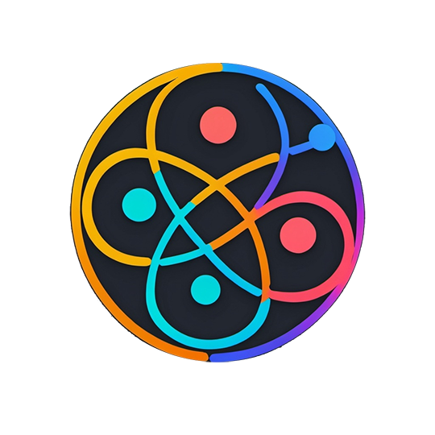

# NestJS GraphQL SPA application: Comments

A progressive Node.js framework for building efficient and scalable server-side applications. 
This repository houses a NestJS GraphQL Comments API with authentication, authorization, and entities like User and Comment for TypeOrm PostgreSQL and a comment index for future full-text search. . 
The project includes microservice architecture with three main components: `client`, `api`, `consumer`.

# Overview
## API

Request Handling: Receives requests from the client and validates them using a validation pipe for new comments.
Authentication: Supports JWT for authentication and validates CAPTCHA (reCAPTCHA).
File Uploads: Uploads files to AWS.
Message Queuing: Pushes messages to the RabbitMQ comment queue and consumes messages from the acknowledgment queue.
Database Operations: Creates requests to PostgreSQL for newly added comments with IDs and publishes them to subscribers with the NewComments token.
Layered Architecture: Utilizes several layers including resolvers, services, and custom repositories.
Hierarchical Structure: The comment table uses a hierarchical structure to support recursive requests for sorting data when queried by the client with paging, sorting, and order options.
Caching: Uses Redis at the resolver layer to retrieve cached comment data for paginated queries.
Event Handling: Utilizes events for various operations such as publishing new comments to subscribers and handling asynchronous processes.

## Consumer

Message Handling: Processes messages from RabbitMQ related to created comments and stores them in PostgreSQL. Additionally, it handles bulk and partial (PG ID and text fields) updates in Elasticsearch for future full-text search features.
Acknowledgment Queue: Provides messages (comment IDs from PostgreSQL) to the acknowledgment queue for the API.

## Client

Frontend: Built with React, GraphQL, and Apollo Client for mutations, queries, and subscriptions (WebSocket).
Auth: Has SignUp and SignIn pages with validation. Receives an access token with SignIn and saves it to local storage.
Comment Creation: Uses JWT tokens from local storage and reCAPTCHA for CAPTCHA validation. Includes necessary validation.
Real-time Updates: Updates the page with the NewComments subscriber.
Event Handling: Subscribes to events for real-time updates, ensuring the UI reflects the latest data without requiring manual refreshes.
Pagination: Supports paginated queries for comments with sorting options for efficient data retrieval and display. Supports root comments sorting by username, email, creation date with necessary sortOrder. Supports sorting of nested comments with createdAt in descending order.

## Support

Nest is an MIT-licensed open source project. It can grow thanks to the sponsors and support by the amazing backers. If you'd like to join them, please [read more here](https://docs.nestjs.com/support).

## Stay in touch

- Author - [Yuriy Stanishevskiy]

## License

Nest is [MIT licensed](LICENSE).
